# Clean Chinese Rare Book Images with GAN

香港中文大学 Multi-media Laboratory 2018.3-2018.5
GAN 古籍图片清理研究

这个项目是研究生时做的GAN相关的项目，针对图书馆中古籍影印图片有透字现象以及纸张发黄灰暗等问题，使用深度学习模型来进行清理和美化，基于CycleGAN模型，添加了边缘检测模块以及边缘loss项来提供额外的监督信息，以克服CycleGAN不善于处理形变的问题，最终使古籍图片变成Word文档般白纸黑字的风格，并保持古籍图片文字内容不变，成功去除透字现象，达到比较好的视觉效果。

代码正在整理中...

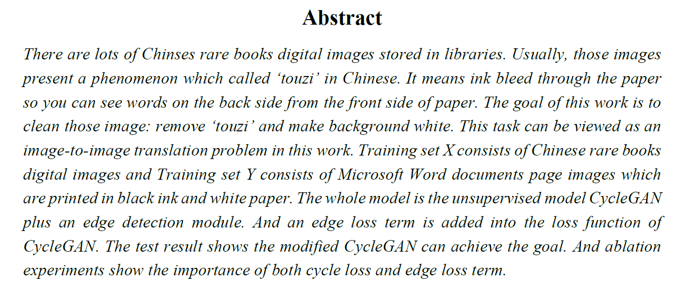
基于采集的古籍图片,训练CycleGAN得到的效果
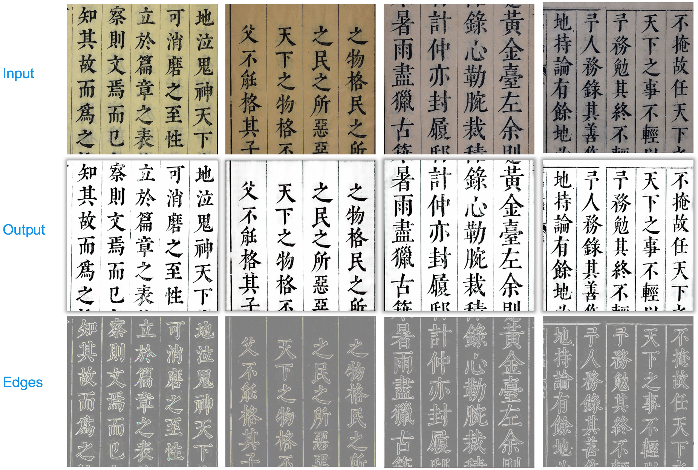
采集的数据，没有草书的图片，但在草书的古籍图片上也取得了较好的视觉效果，证明了模型有一定的泛化性
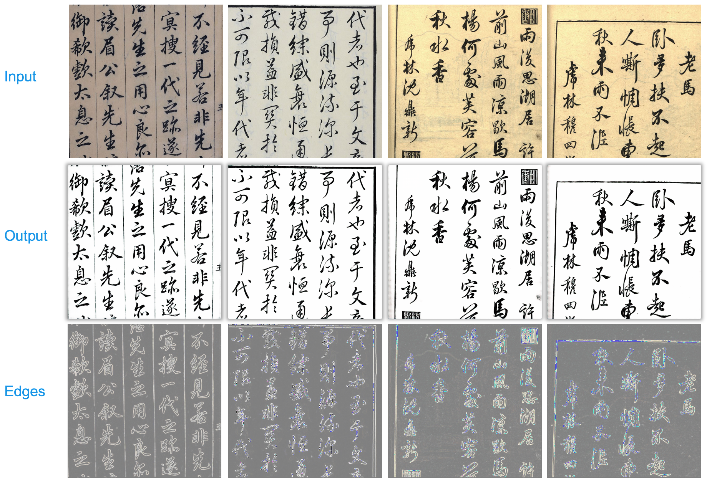
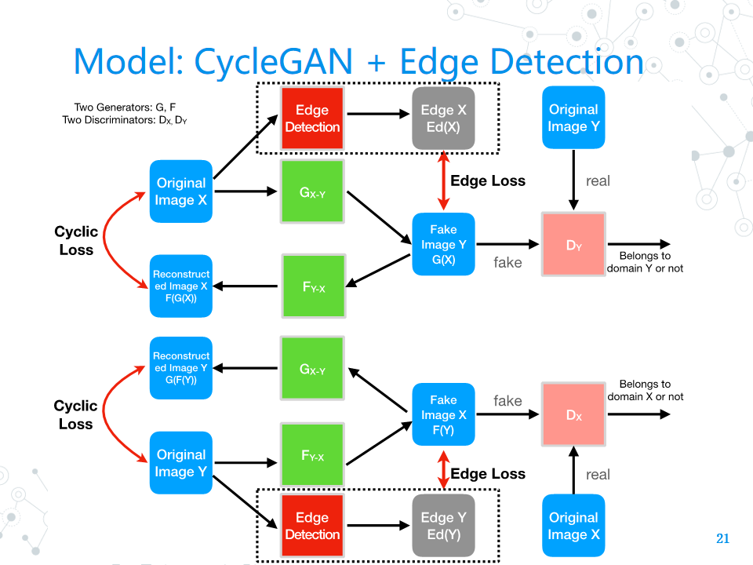

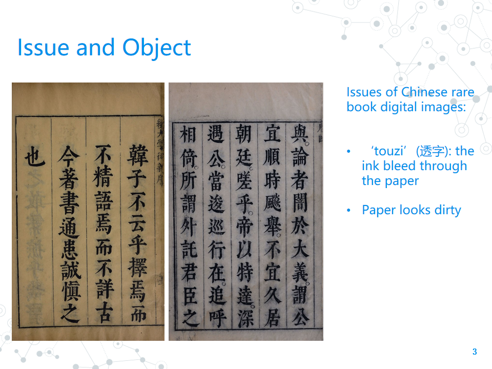
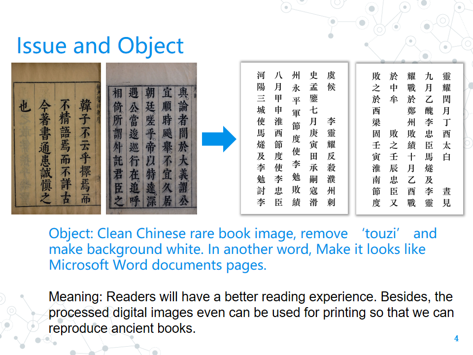
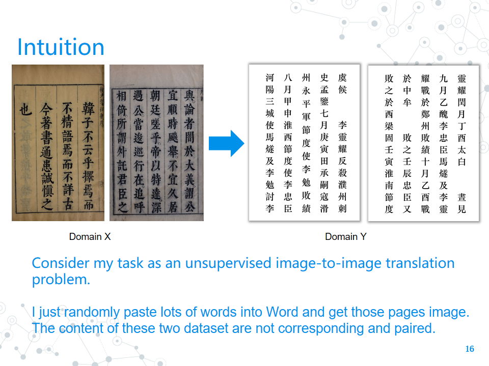
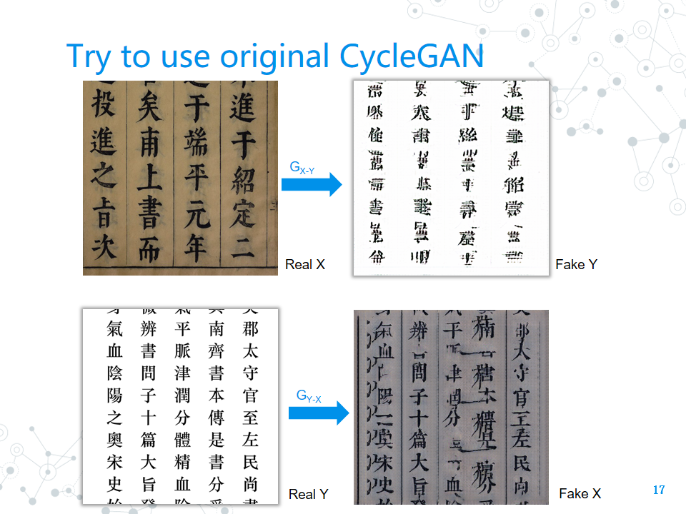
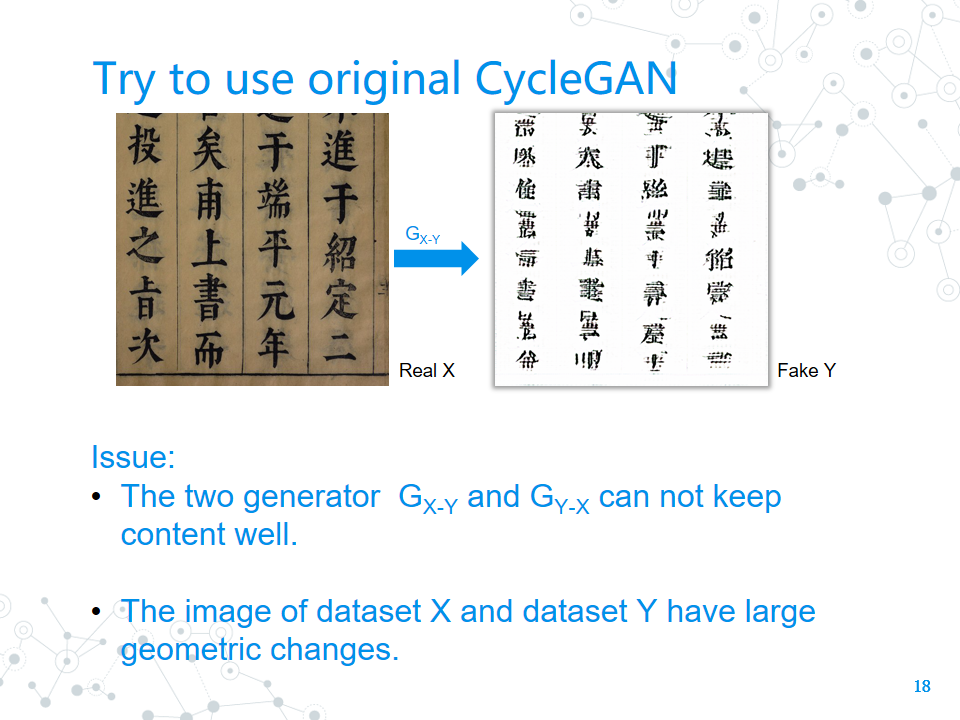
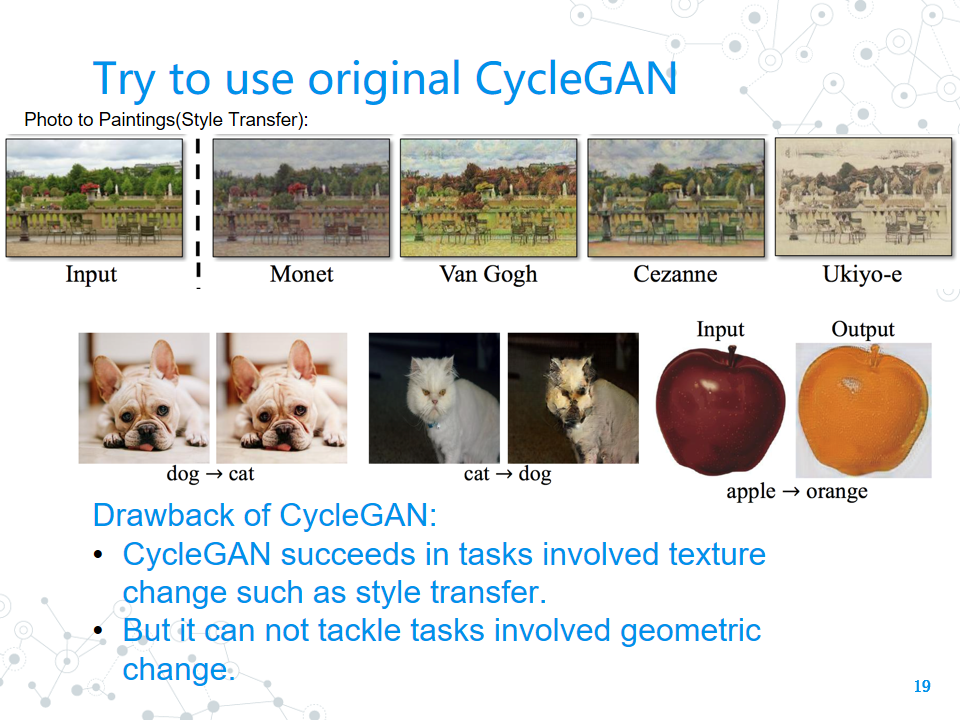
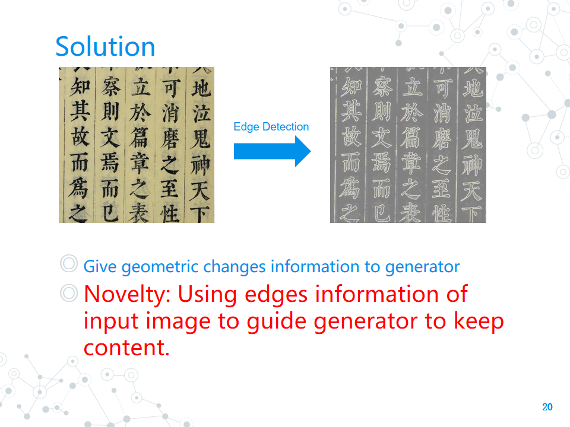
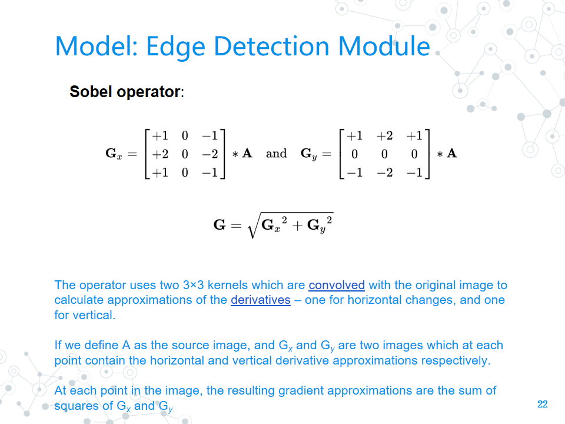
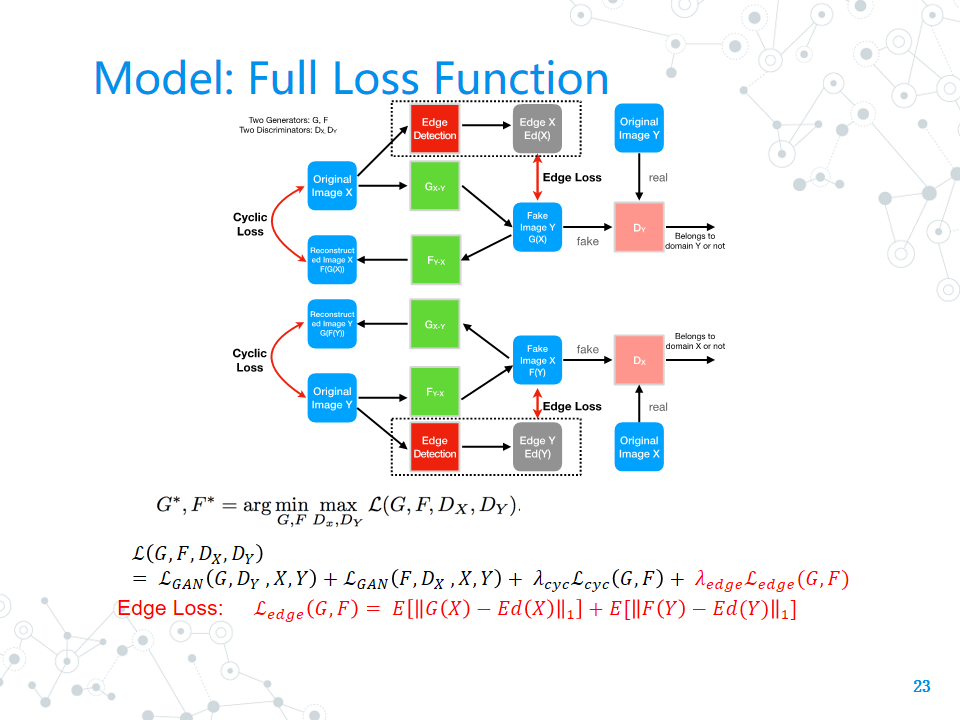
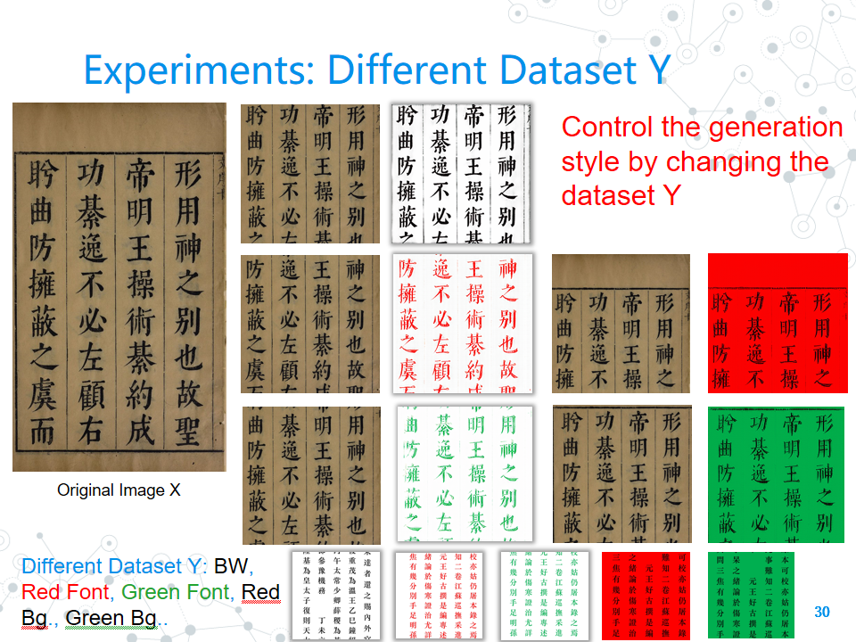
